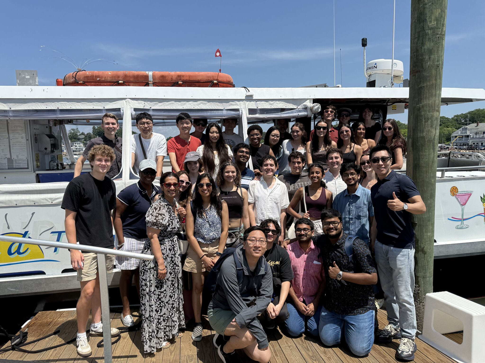

I'm still recovering from the tired but happy six-week BDSY. I joined the program in April and had no idea what I should do at first. Then I spent two full months working on the program schedule of six weeks' lectures and events. Tens, if not hundreds, of emails were sent to and received from different people across Yale and outside Yale. It's my first time organizing such a big program. I want to thank Jackson, Yiren, Aquielle, Matt, and Bhramar for this amazing experience.

We were all shocked when knowing these 28 students were chosen from 860+ applications. There is no doubt that they are talented and smart students. I spent these six weeks with them, teaching classes, climbing hills, kayaking on the lake, and playing ping pong. Sometimes I feel I'm still an undergraduate student and still energetic. It's always happy to stay with young people.

<figure>
    
    <figcaption>Thimble Island Tour</figcaption>
</figure>

Now, after everything is done, I'm starting to think about next year's BDSY, and maybe my own BDSY in the future. Education always interests me, and summer programs are definitely good chances for students to learn more. It will be a massive messy process but it the outcome is beneficial, why not?
