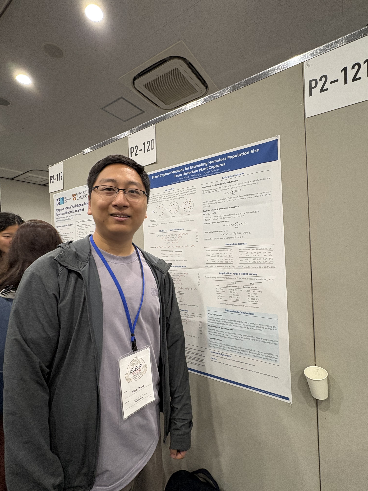
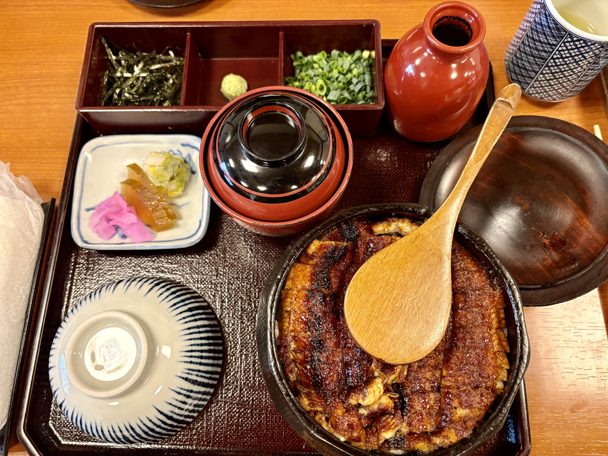
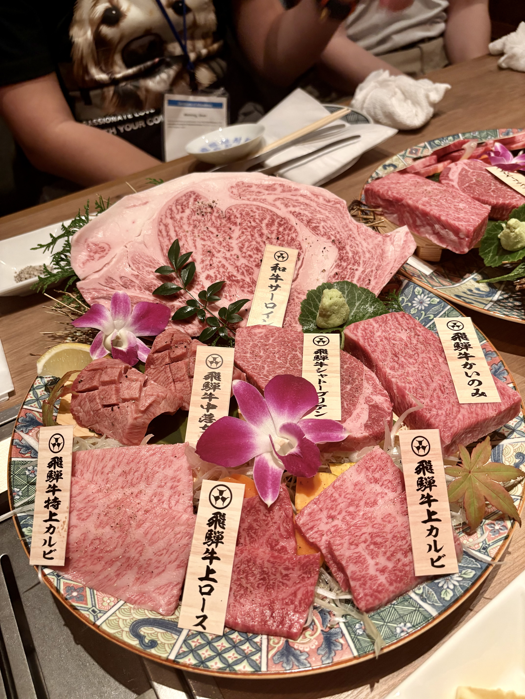
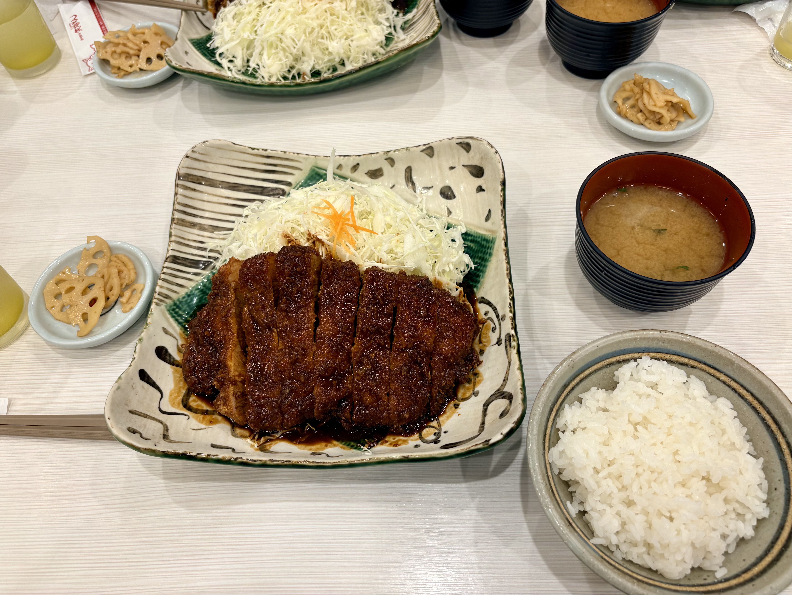

<!-- Tip: open with the why, then show results, code, and next steps. -->
I was back to Japan after 11 years for one of my favourite conferences, ISBA! The last time I've been to Nagoya was 2015 when I was a sophomore student, and then I didn't any chance to go back to Japan again. When I heard ISBA will be held in Nagoya, I was so happy and decided that no matter how much it costs, I will be there. So I registered during my umployment period, and luckily I got the job offer before attending ISBA.

One topic I've been looking into is cut Bayes. I recently learned this method because in Bayesian causal inference, sometimes we need to reduce the dimension of exposures first, then fit an outcome model. But if we use a joint likelihood, when we sample the exposure, it will be conditional on the outcome, and this is called outcome feedback. In causal inference, this relationship is invalid, as the outcome should not influence the exposure. Therefore, cut Bayes, including modular Bayes methods, is used in this scenario. I enjoyed the talks by Dr. Robert Goudie and others, but I don't really like their motivation: when you have a good quality dataset and a bad quality dataset, you want to use good quality dataset only to estimate the parameters that also related to the bad quality data, to avoid the bad quality data worsening the results. However, I do think the methodology is for the same purpose and can be used in our situation.

The other goal for me on this trip is to eat delicious Japanese food. Unagi, pork cutlet, sashimi, sushi... So many food in this one week!

At the same time, I met a lot of my friends during ISBA. One topic we can't escape is this year's job market. Some of my friends have accepted the offer from mainland China, and some are still preparing for the next year. I hope everyone the best luck and hope we won't be replaced by AI LOL.
