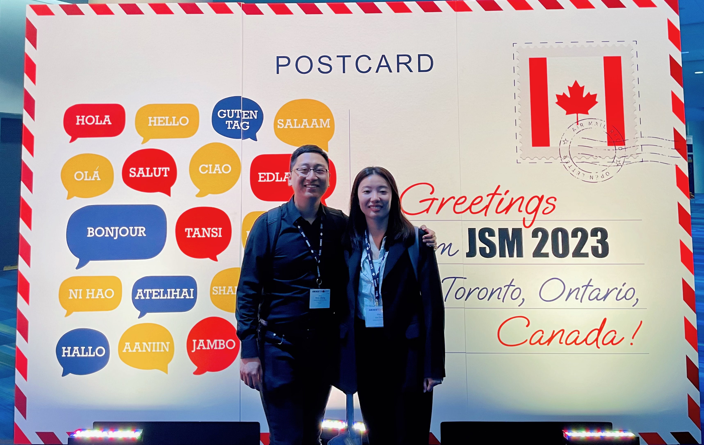

Okay, my second post is about the conferences this year. I commonly attend one statistical ecology conference (EURING or ISEC), SSC annual meeting and maybe one more statistical conference. And I haven't had the chance to attend any conference outside Canada in person. A good thing for this year is that JSM held in Toronto, so that I finally get the chance to attend JSM since I've heard of it five years ago. Hooray! And I also got the opportunity to organize CSSC, which I think is the biggest student conference in Statistics in Canada. It's an amazing experience and I recommend everyone who wants to improve organizing skills to apply for it.

This year's SSC and CSSC were held at Carleton Unviersity in Ottawa. I've been to Ottawa last year for the CANSSI summer school at University of Ottawa, but I've never come to Carleton before. Overall, it was a wonderful experience, and I made a lot of new friends. Also, this is the first in-person SSC since 2020, and I'm surprised about the food provided, expecially the supper in a museum, which was really impressive. I also want to thank my colleagues in the CSSC organizing committee. We have worked together for months, and the result is over our expectation. We not only got such a good experience, but also made many friends here.

Two months later, JSM was held in Toronto. As the biggest conference in Statistics, I've never seen a such large scale and so many famous statisticians. There were a lot of great talks, and many interesting events. Also, I spent most of my time wandering in the EXPO. A tip I got is that some publishing companies will give out their sample books. I got three free books here and I even got a signature from Dr. Andrew Gelman himself! I have to say that I'm a big fan of Dr. Gelman, though it sounds a little chiildish. Meeting him in person, talking with him and even getting a signature from him are definitely a unforgettable memory in my life.

Except conference, I also attened a workshop at the Fields Institute about statistical ecology. I'm happy that I learned something won't appear in a Statistics class, which is the collaboration with government, industry and even indigenous community. I must admit that I don't have enough knowledge about the Canadian culture, especially the parts about indigenous people. And it's very interesting to learn about their knowledge which is qutie different but helpful for the research. I feel it's like Chinese medicine somehow since maybe science cannot explain the underlying mechanism and it's more based on experience from generations of people.

Since I'll graduate next summer, I may not have the chance to attend any conference next year. Hopefully I can attend SSC at least since it will be held at Memorial University and I've never been to any province east to Quebec.