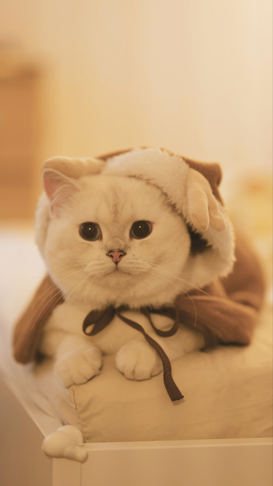

Wow, I still can't believe that I wrote nothing this year! But so many things happened since last July! I will write three posts to summarize what has been missed on this website. First post will be about cats. Oh I forgot to say that we have a new family member, Lemon!!! 

Lemon is a British shorthair cat. It is a little different about the description of color between English and Chinese. In general, Lemon is a white cat, but in Chinese, a white cat is a "silver" cat (Also dark grey = blue, yellow/orange = gold). And he has grey point coloration (a new word I learned from Wikipedia), which is related to his gene. We have him since last August, and he is already 1.5 years old. Quite amazing to watch him growing up from a small kitten to a big cat. Now he's more than 4.5 kgs, and quite heavy when I hug him.

In this January, Lemon first suffered from burn after he jumped on the hot cooktop. During his recovery, he also suffered from a seizure caused by meningoencephalitis. Thankfully it's not primary epilepsy which is very common in pedigree cats. The whole recovery process took months. And now, Lemon is healthy and playful. Always curious about the outside and attempted a few times to run to the corridor when we opened the suite door.

After experiencing Lemon's suffering, I watched a few documentories about vet clinic and decided to apply for volunteers for car rescue organizations. Now I have been volunteering for Toronto Car Rescue and Action Volunteers for Animals for eight months. During this period, I met a lot of different cats and also different people. Some people surrendered their cats because various reasons, such as allergy, cannot afford the medication fee, too many new-borns because they didn't neuter or spay their cats, leaving the town and cannot bring their cats. Especially during summer, some international students graduated and went back home, leaving their cats behind. 

The Trap-Neuter-Return(TNR) program is another source for the adoptable cats. The rescue staff will go to certain areas and try to trap street cats there. Then they will be sent to a vet clinic and have a physical check. If a cat is feline leukemia positive, he/she will be put down since the virus will kill them slowly with a lot of pain. Otherwise, they will be neutered or spayed to control the number. If they show any friendly gesture, they will be sent to a foster home and hopefully be adopted later. If not, they will be sent back to where they come from, since they may already have a community there.

If you are not sure about having a cat or dog as a pet at home, you can apply for a volunteer or foster home first to see if you really like them and won't be allergic to them. But once you have one, you will enjoy the time with them and cannot stop sharing their photos just like you have a baby!