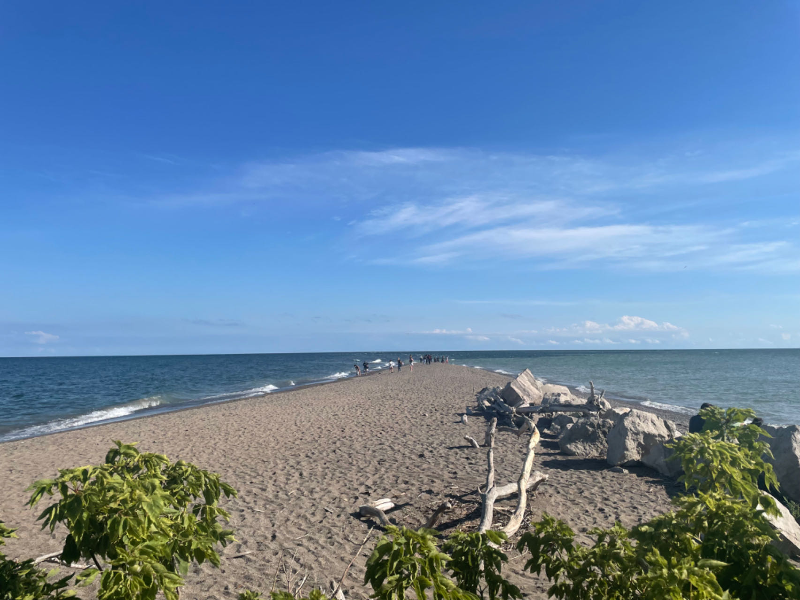
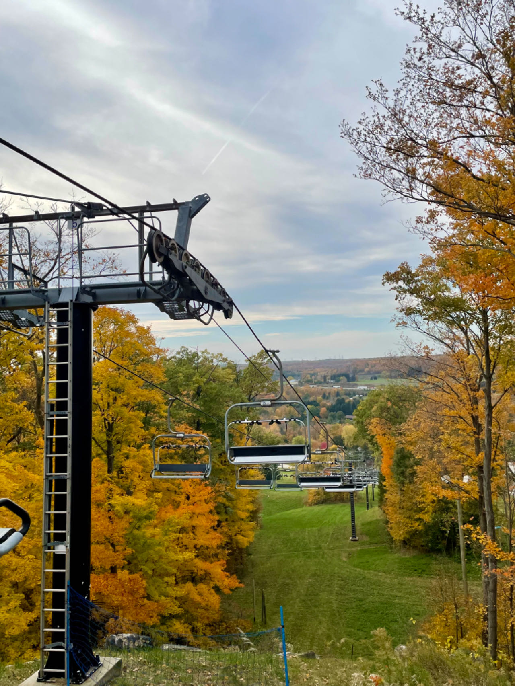

Sorry for the late post. It's already 2024! I just don't have enough enthusiasm to update on time LOL. One important thing for 2023 is that my mom came to Canada to spend her summer break. She has been to US as a visiting scholar but never came to Canada. I first brought her to Montreal and Quebec City which are two cities that I am familiar with.

<figure>
    
    <figcaption>Montreal</figcaption>
</figure>

<figure>
    
    <figcaption>Quebec City</figcaption>
</figure>

And also the Niagara Falls!

<figure>
    
    <figcaption>Niagara Falls</figcaption>
</figure>

After we came back to Toronto, she was invited by one of her professors, who taught her during her undergraduate, to visit her house in Windsor. So we drove to Windsor and on the way we also went to Point Pelee National Park, which is the southernmost point of mainland Canada.

<figure>
    
    <figcaption>Point Pelee</figcaption>
</figure>

After JSM, we went to Alberta and BC. We started from Edmonton, then Jasper, Banff, Alberta, and Vancouver at the end. I always saw my friend's photos in Jasper and Banff, but it's really amazing when you look at it by yourself. The wild animal is walking aside the road and sometimes you have to wait deers and goats crossing the road. For me, I work on statistical ecology but never had a field work. This trip is like a field work for me.

When summer ends, it's time to walk in the falling leaves! We hiked in Kelso Conservation Area. The route is not too long, but the scene is very beautiful.

<figure>
    
    <figcaption>Kelso Conservation Area</figcaption>
</figure>

Hopefully in 2024, I could travel to more places. If possible, I hope I can go back to China and travel to more cities I haven't been to. Wish me good luck!