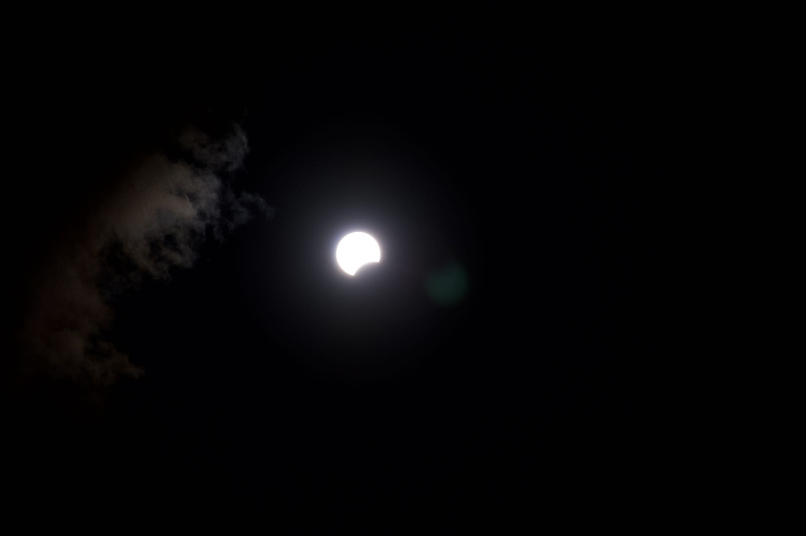
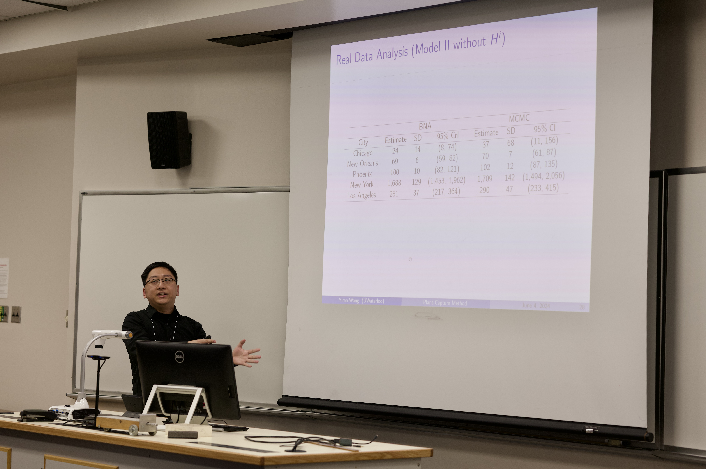
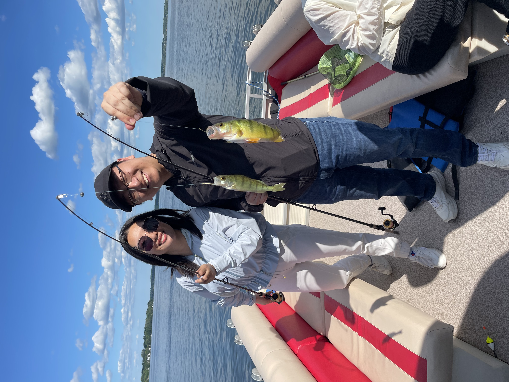
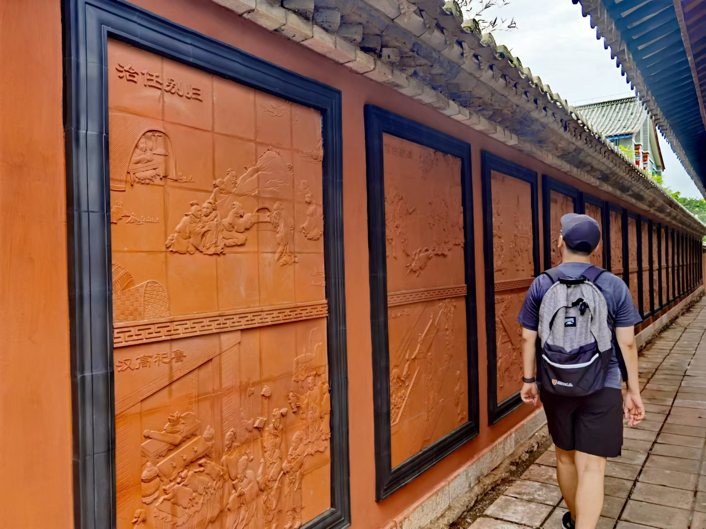

Another year is almost finished, and I didn't post anything in this year!!! Well, I can find one excuse that I'm too busy LOL. Let me look back and see what I have done in this year.

In March, I went to the only concert I attended in 2024, which is Joker Xue's concert. I always want to attend Joker's concert once and I didn't expect it will be in Toronto!
<figure>
    
    <figcaption>Joker Xue Toronto Concert</figcaption>
</figure>

In April, I went to NYC and attended an in-person interview for a postdoc position. It was the first time entering US since I graduated from UC Irvine 5 years ago. Well, strange and familiar. After coming back, we had the chance to watch the total eclipse in Toronto (though it was very cloudy).
<figure>
    
    <figcaption>The beginning of the eclipse</figcaption>
</figure>

What happened in May and June? Oh right, the SSC. This year's SSC annual meeting is in St. John's, which is the easternmost city I've ever been in Canada. Before this, it was Quebec city. This is also the first conference for me as an invited session speaker. I guess the only difference is that the talk is now 30 mins instead of 15 mins. I always say that after leaving Dalian, I didn't really have any good seafood as I had in Dalian. But St. John's does have good seafood! I didn't get the chance to stay longer, but the other people who took a trip after the conference watched icebergs and puffins!
<figure>
    
    <figcaption>SSC in St. John's</figcaption>
</figure>

In July, I tried fishing for the first time. And it turns out that I'm not too bad at it LOL.
<figure>
    
    <figcaption>Fishing on Lake Scugog</figcaption>
</figure>

August! The exciting August! I sucessfully defended my Ph.D. thesis. And soon after the PhD defense, I flew back to China to stay with my family. I didn't realize that it's been three years since last time I flew back to China. I spent more than a month in China, staying at home, travelling to Yunnan with my mom, and trying all kinds of delicious food. The older I am, the more I'm worried about my parents' health. Hope I can find more time to spend with them in the future.
<figure>
    
    <figcaption>Trip in China</figcaption>
</figure>

In the golden October, we went to Mont Tremblant fo the colors and hiking. When you wake up in the morning and see the sunlight shining on the lake, you'll feel that it was completely worth driving all day to get to this place, though the zipline is so freezing cold....
<figure>
    
    <figcaption>Hiking in Mont Tremblant</figcaption>
</figure>

After our autumn relaxing trip, it was my convocation ceremony at the end of October. Though my parents can't make it, I still feel so excited to celebrate with my friends.
<figure>
    
    <figcaption>I got my Ph.D. degree!</figcaption>
</figure>

So what happened this month? I moved to New Haven and officially became a postdoc at Yale University! I've never thought about a position at Yale, since this name is like in another universe for me. Thanks, Spiderman, for messing up the multiverse. I'm still getting used to this new character and I hope everything will be good in these two years!
