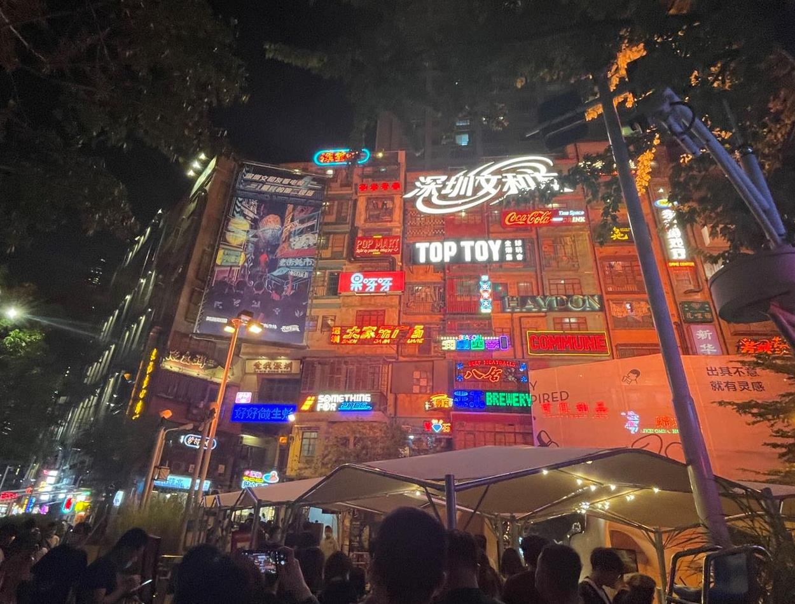
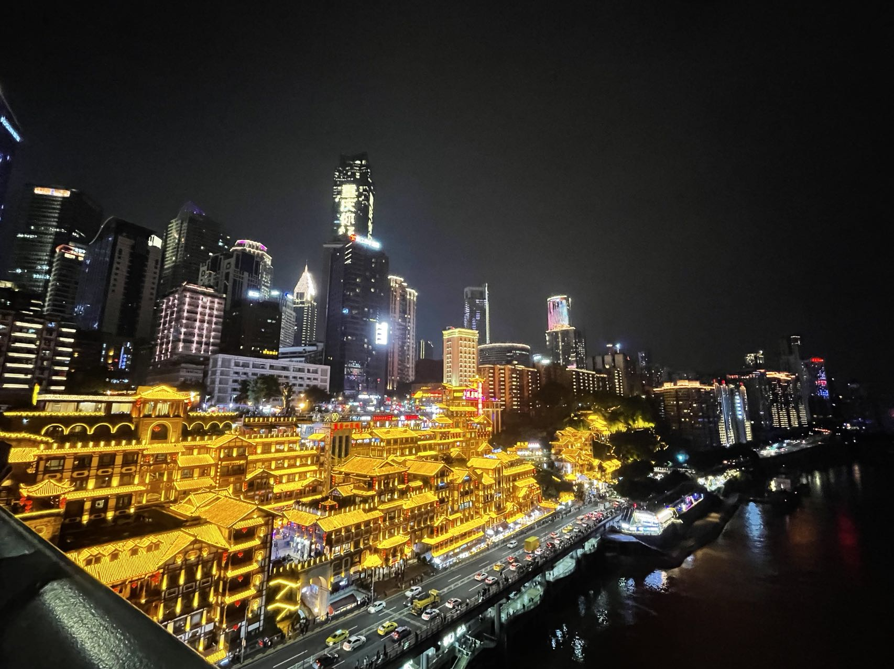
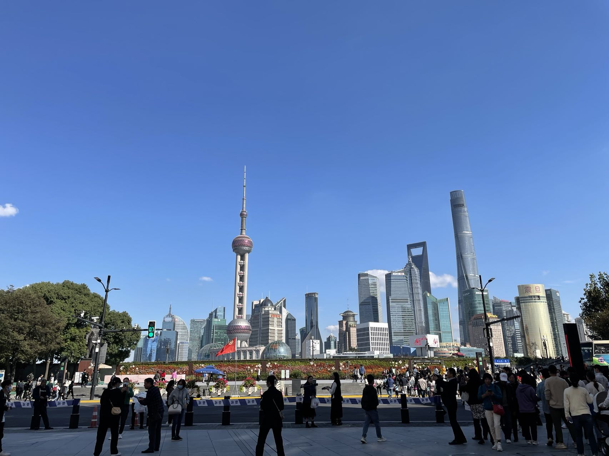

Well, I came back a term later than what I expected in the last post. Thanks to the online term for Fall, I got a few months to stay with my family and travel around China. 

After I passed the Customs in China, I got 28-day quarantine before I went home. Though it's boring, I had some good food when I quarantined in Xi'an. After the quarantine, I got two doses of vaccines. I was planning to travel with my parents in the summer vacation, however they cannot leave the city according to the policy of their univeristy. So I have to travel on my own. I picked three cities for this trip: Shenzhen, Chongqing, and Shanghai. 

I first arrived in Shenzhen, Guangdong. Shenzhen is a quite young city with a rapid development, and many technology companys are located in Shenzhen, such as Huawei. To be honest, quite a number of my classmates are working in Huawei. I've met some of my friends in Shenzhen and tried many kinds of delicious food. Shenzhen has more residents from other cities than locals, and it's very easy to get a Shenzhen residence, so there are a lot of different styles of food from all the provinces in Shenzhen. However, there are three local cultures in Shenzhen: Cantonese, Chaoshan, and Minnan, each of which has their own language and food. 

Next, I went to Chongqing, which is a city famous for its spicy food and rugged topography. Chongqing was once the capital of China in the WWII, so there are many historical buildings. Also it's common in Chonqing that you enter a building, take an elevator 20 levels up, and arrive at the "ground level". Since there are a lot of mountains in Chongqing, the buildings were built close to the hills and mountains. As a result, there are multiple entrances, some of which are at the bottom and some are at the top, but they all face a road, so it's hard to define a "ground level".

Finally, I back to my "second hometown" Shanghai. I've been here for 4 years during my undergraduate time. It always feels familiar when I arrived in Shanghai. Though I cannot enter my Alma Mater due to the COVID policy, I went to some places that I once visited many times like the Bund.

After I flew back to my home in Dalian, I encountered a wave of COVID. Since Dalian has around 70% cold-chain logistics of China, it's very easy to find new cases in these companies. Except the lockdown of the whole city, we have experienced 5 times of COVID tests in two weeks. It's a little radical but effective.

Well, I successfully made it to Canada before Christmas! I have been suffering from the jetlag since Christmas, but feels better today since the sun has appeared. Hope we can reach an end of this pandemic as soon as possible in the new year.