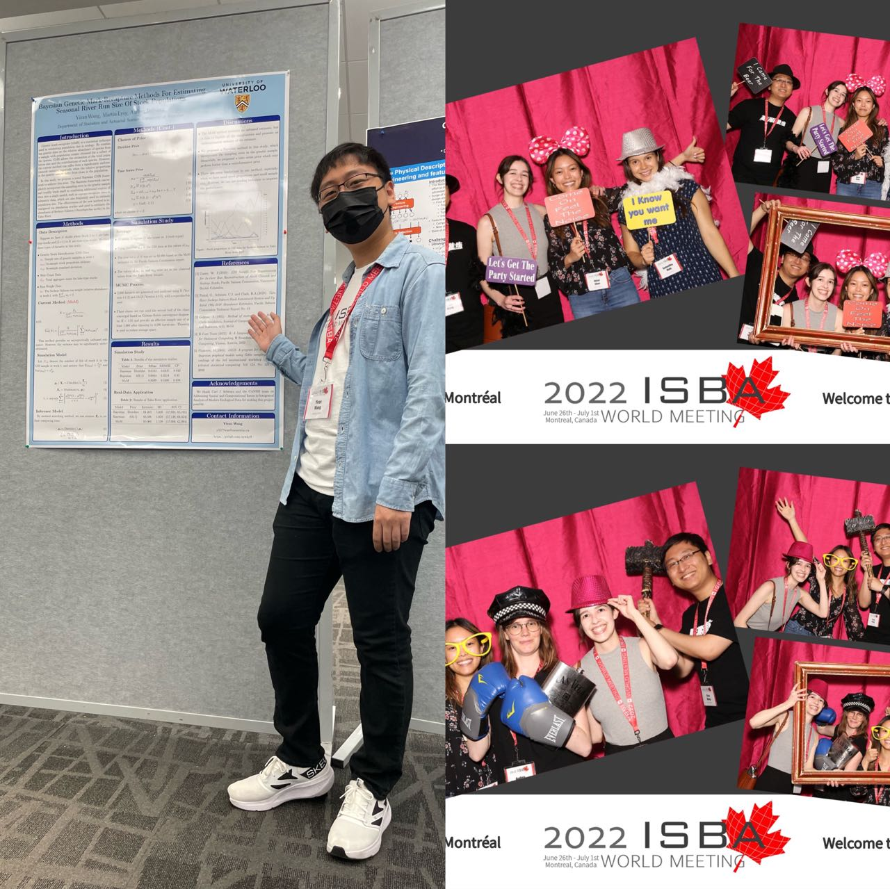
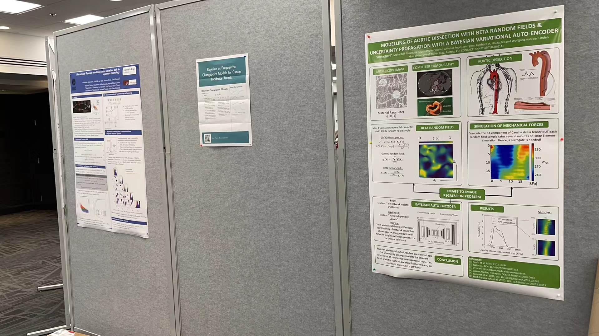
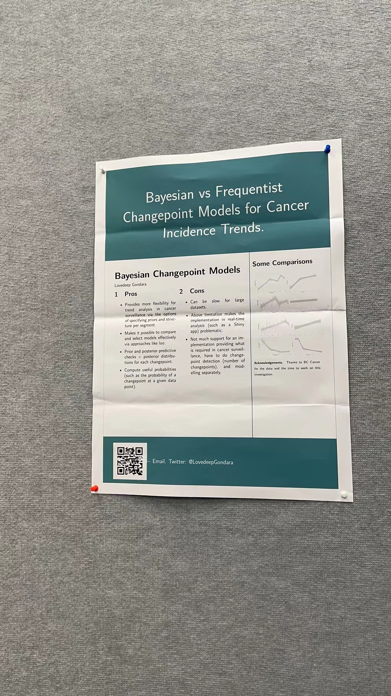
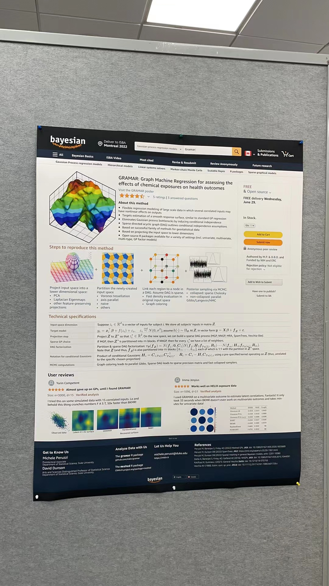
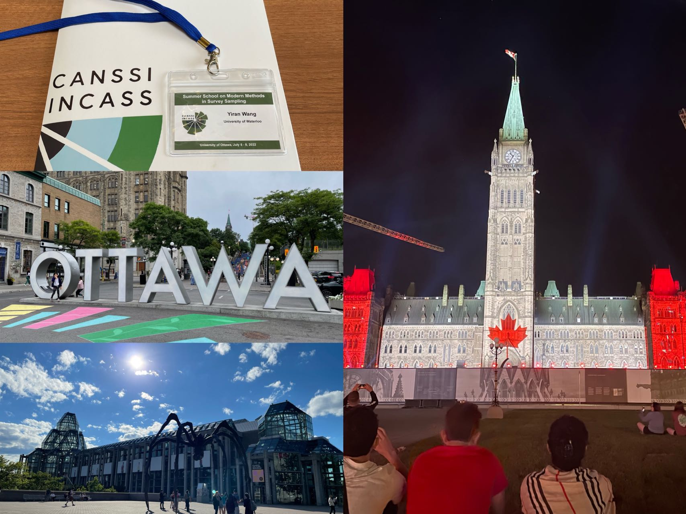
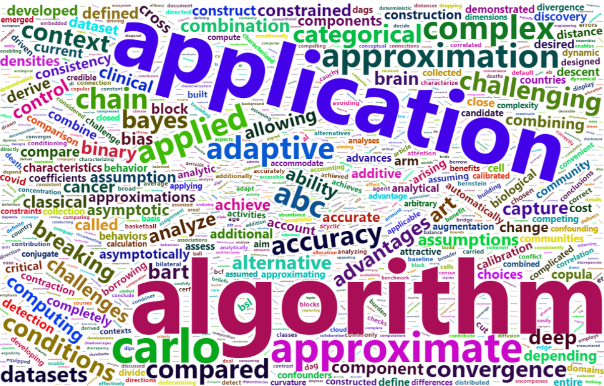
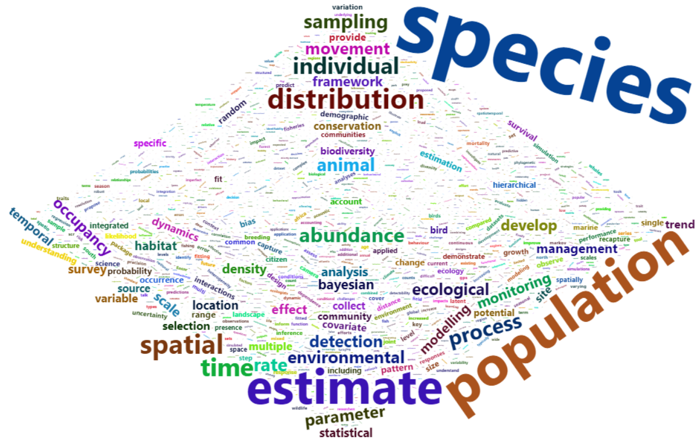

Finally, I finished my 2-week conference season for 2022! I never thought my first in-person conference will come so late. Just after I came to Waterloo in 2019, I got a chance to go to Sydney, Australia to attend ISEC. Though I've already got my visa ready, the pandemic attacked and the conference changed to online. There were some in-person conferences at UWaterloo these years, but I didn't really "attend" them. At the end of my third year for PhD, I finally get this opportunity to attend ISBA 2022 in Montreal! And there is no doubt that the main reason is that it's in Canada LOL. Thanks to my professors from UC Irvine, I met a lot of professors from US, and also some graduate/undergraduate students in Montreal. I was a little sad that Andrew Gelman didn't come but I luckily met one of his postdocs who will join USC soon. It feels so good to have so many Bayesians together. It's something hard to feel if you are in a stat department in Canada, since there are not so many Bayesians in Canada. And I also gave a virtual presentation to ISEC 2022 during the opening address for ISBA in the hotel room. I'll say this must be some rare experiences that I could mention as a fun fact.

Though there were many interesting talks, I found the poster sessions were the real treasure. For the first poster session, one poster attracted everyone's eyes. Yes, it's too small for a poster.

And if you get close to read the content, emm not bad. At least you can check his website.

Also, there are some interesting template, though it's a little hard to find the real contents.

After coming back from Montreal, I stayed at home for 2 days, prepared a week's food for Mei, and left again for the CANSSI summer school in Ottawa. I have been to Montreal before, but for Ottawa, it's the first time. My friends and I found the flight ticket is almost the same as the train ticket and much faster, so we planned to fly to Ottawa. But our flight first changed from Bishop airport to Pearson airport, then after several delayed announcements, it got cancelled. We were so lucky that we got the seats from the standby list of a flight leaving at 9 pm, instead of the one we were rebooked leaving at 12:30 am.  

I must say Changbao's talks are very exciting compared to the other talks. We almost fell asleep during the other talks, but Changbao's energy passed to all of us. Sadly, I was expecting to see Xiaoli Meng at both ISBA and the summer school, but he didn't come to any of them in person. But we met a lot of new friends in Ottawa, and watched the light show at parliament hill. 

There is also a fun story during the conference season that I want to share. I met Prof. Vianey Leos Barajas from University of Toronto at ISBA and asked her if there is any professor working on statistical ecology in US, and she listed some professors she knows including Prof. Ephraim Hanks from Penn State. So I asked my new friend Samantha from Penn State about him. She told me she knows one of his PhD students and gave me the name. I found her twitter said she will come to Ottawa for the CANSSI summer school. What a coincidence! I mean, it's almost impossible for someone in US to hear about this summer school. So I met Liz in Ottawa and discussed about statistical ecology a lot. It's so nice to meet and talk with my new friends! Hope we can meet soon!

Last but not least, I tried to make work clouds of the abstracts from ISBA and ISEC so that I may find some popular topics. But it's very difficult to make them as expected. I removed some non-informative words and these are the results I got. It could be better if I can include some specific phrases, but I give up since it's very time-consuming and I'm not quite familiar with NLP to be honest. Let me know if you know some resources that are easy to understand and simple to apply!

