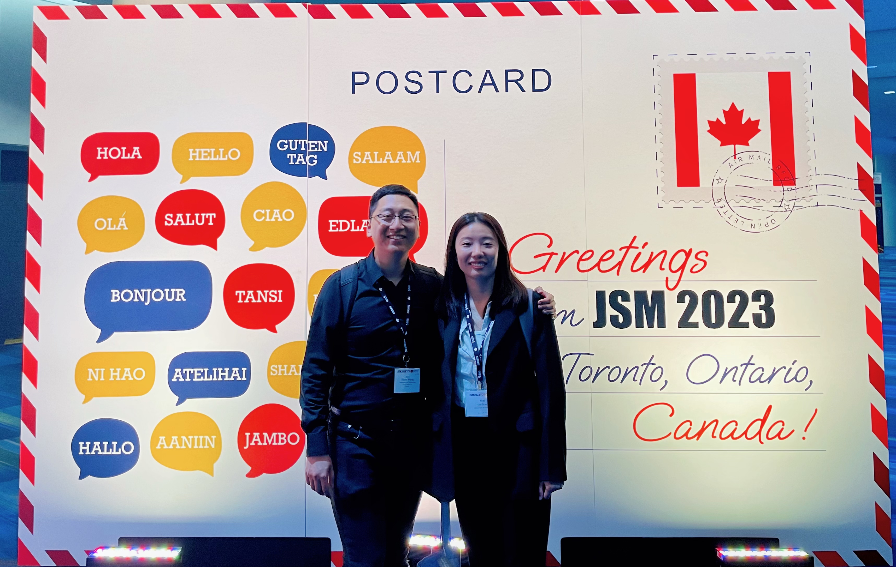

> 说明：本文为英文原文的 AI 辅助中文翻译，可能没有完全保留原文语气；如需核对细节，请切换到 English 版本。
好，第二篇来写今年的会议。我通常会参加一个统计生态学会议（EURING 或 ISEC）、SSC 年会，也许还会再参加一个统计会议。我之前一直没有机会亲自去加拿大以外的地方参加会议。今年的好处是 JSM 在多伦多举办，所以我终于有机会参加这个五年前就听说过的会议。太好了！我还参与组织了 CSSC，我觉得这是加拿大最大的统计学生会议。这是非常棒的经历，也推荐想提升组织能力的人去申请。

今年的 SSC 和 CSSC 都在渥太华的 Carleton University 举行。我去年去过 University of Ottawa 参加 CANSSI summer school，但之前从没去过 Carleton。总体来说，这是一次很好的经历，我认识了很多新朋友。这也是 2020 年以来第一次线下 SSC，让我惊讶的是会议提供的餐食，尤其是在博物馆里的晚宴，印象非常深。我也想感谢 CSSC 组织委员会的同事们。我们一起工作了几个月，结果超过了预期。我们不仅收获了很棒的经历，也交到了很多朋友。

两个月后，JSM 在多伦多举行。作为统计学最大的会议，我从没见过这么大的规模，也没见过这么多著名统计学家。会议里有很多精彩报告和有趣活动。我大部分时间都在 EXPO 里闲逛。一个小技巧是，有些出版社会发样书。我在那里拿到了三本免费书，甚至还得到了 Andrew Gelman 博士本人的签名！虽然听起来有点幼稚，但我必须承认我是 Gelman 博士的粉丝。能见到他、和他说话、还拿到签名，绝对是我人生中难忘的回忆。

除了会议，我还参加了 Fields Institute 关于统计生态学的 workshop。我很高兴学到了一些统计课上不会出现的内容，比如和政府、产业界，甚至原住民社区的合作。我必须承认自己对加拿大文化了解不够，尤其是原住民相关的部分。了解他们的知识很有意思，这些知识和我熟悉的体系很不同，但对研究很有帮助。我感觉它有点像中医，也许科学还不能解释其中的机制，但它更多来自一代代人的经验。

因为我明年夏天就要毕业，明年也许没有机会参加太多会议。希望至少能参加 SSC，因为它会在 Memorial University 举办，而我还没去过魁北克以东的省份。

