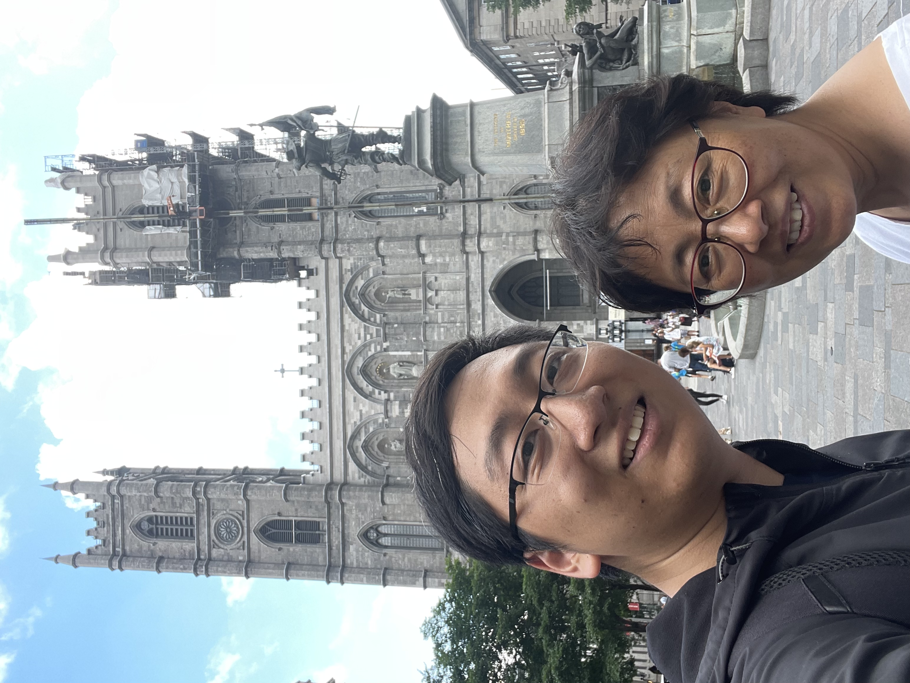
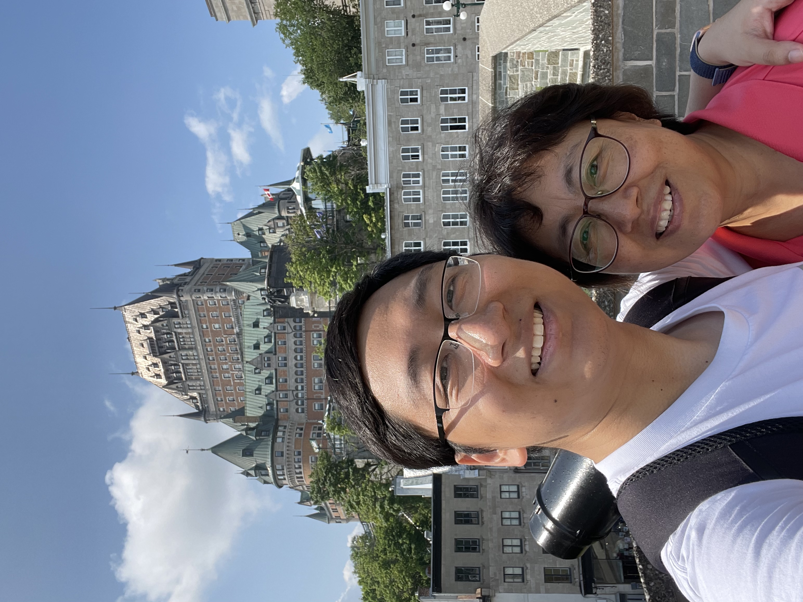
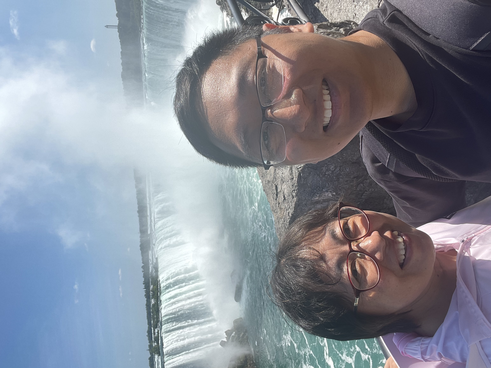
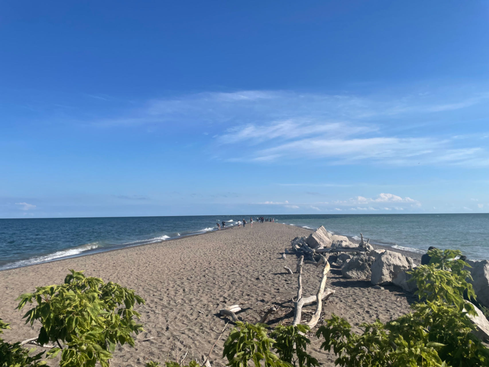
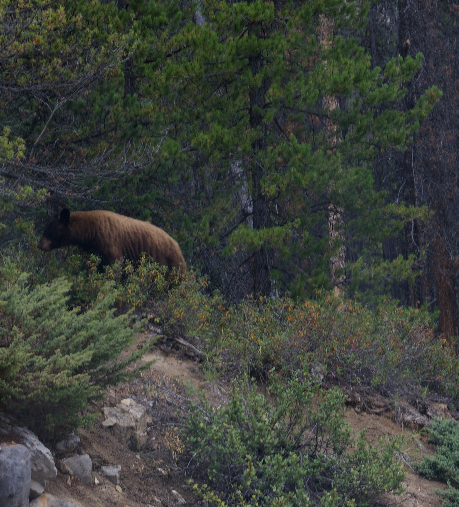
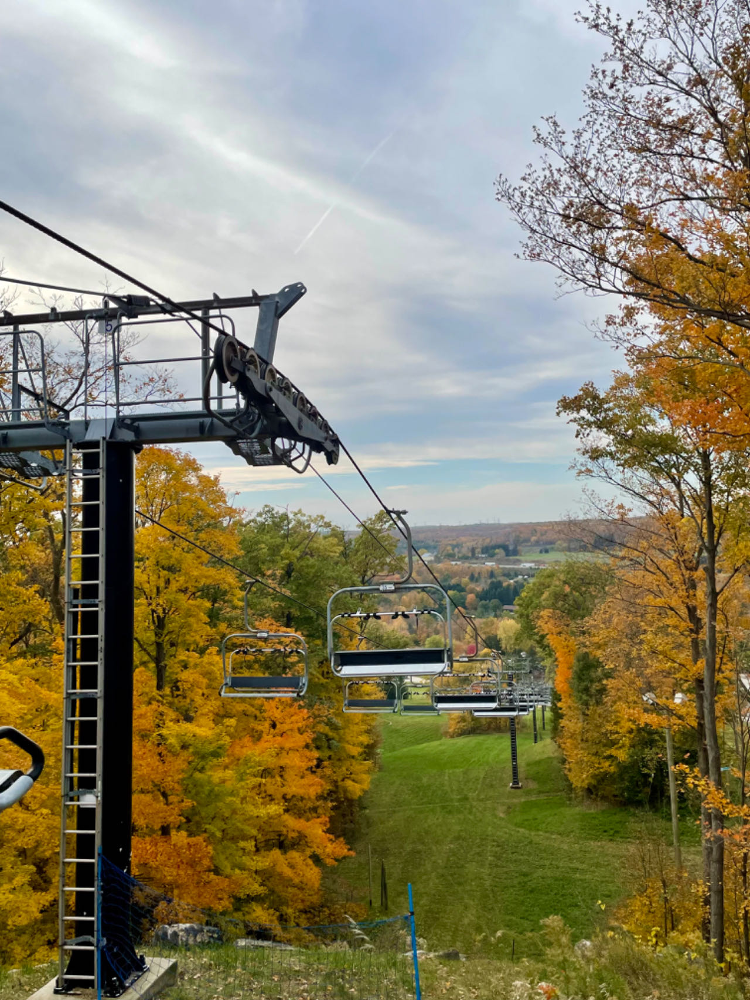

> 说明：本文为英文原文的 AI 辅助中文翻译，可能没有完全保留原文语气；如需核对细节，请切换到 English 版本。
抱歉这篇来晚了，已经 2024 年了！我只是没有足够热情按时更新。2023 年一件重要的事是我妈妈来加拿大过暑假。她以前作为访问学者去过美国，但从没来过加拿大。我先带她去了我比较熟悉的蒙特利尔和魁北克城。

<figure>
    
    <figcaption>Montreal</figcaption>
</figure>

<figure>
    
    <figcaption>Quebec City</figcaption>
</figure>

当然还有尼亚加拉瀑布！

<figure>
    
    <figcaption>Niagara Falls</figcaption>
</figure>

回到多伦多后，她本科时的一位老师邀请她去 Windsor 家里做客。所以我们开车去了 Windsor，路上还去了 Point Pelee National Park，这是加拿大大陆最南端。

<figure>
    
    <figcaption>Point Pelee</figcaption>
</figure>

JSM 之后，我们去了 Alberta 和 BC。路线从 Edmonton 开始，然后是 Jasper、Banff、Alberta，最后到 Vancouver。我以前总看到朋友在 Jasper 和 Banff 拍的照片，但真正自己站在那里看时，还是觉得非常震撼。野生动物就在路边走，有时候还要等鹿和山羊过马路。对我来说，虽然我研究统计生态学，却从来没有做过野外工作。这次旅行有点像属于我的 field work。

夏天结束时，就到了在落叶里散步的季节。我们去了 Kelso Conservation Area 徒步。路线不算长，但风景很美。

<figure>
    
    <figcaption>Kelso Conservation Area</figcaption>
</figure>

希望 2024 年我能去更多地方旅行。如果可以的话，希望能回中国，也去更多没去过的城市。祝我好运！

