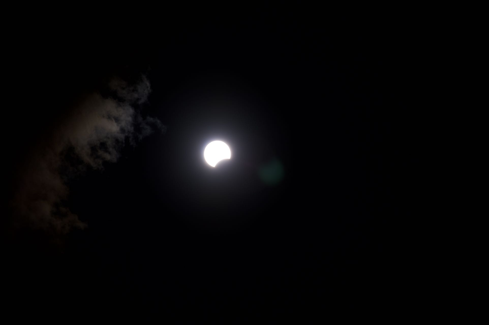
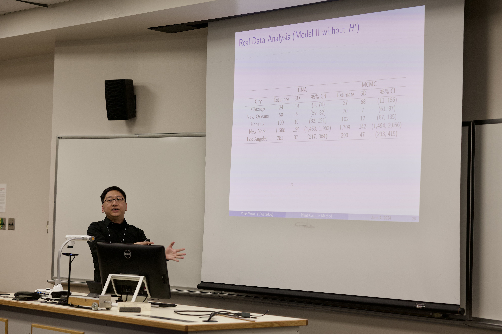
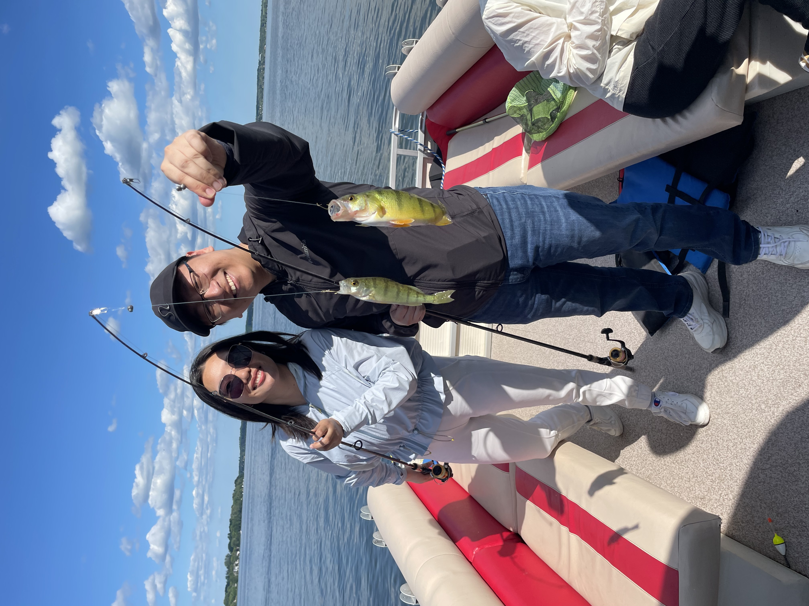
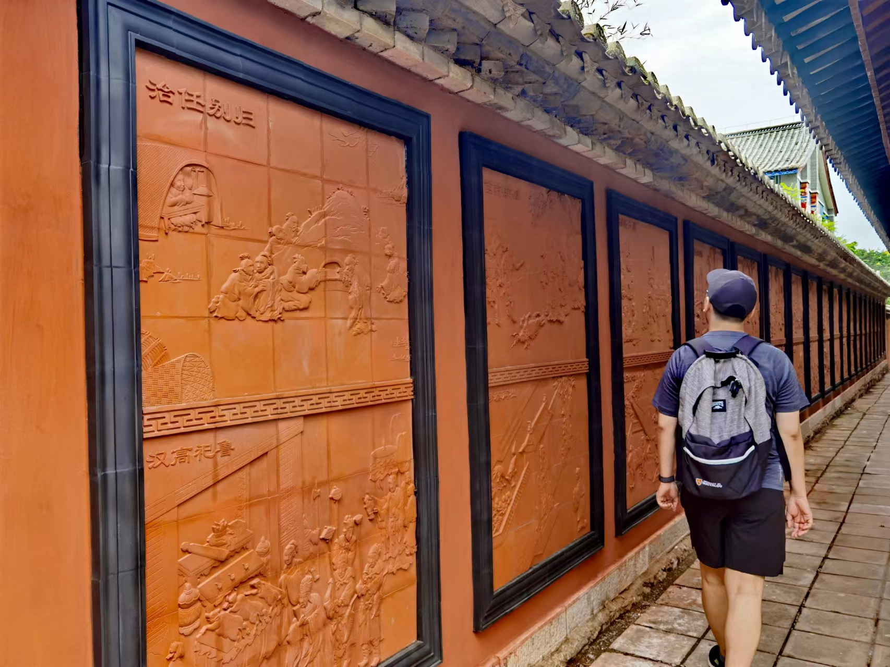

> 说明：本文为英文原文的 AI 辅助中文翻译，可能没有完全保留原文语气；如需核对细节，请切换到 English 版本。
又一年快要结束了，而我今年居然什么都没有发！好吧，我可以找一个借口：实在太忙了。那就回头看看这一年都发生了什么。

三月，我去了 2024 年唯一一场演唱会：薛之谦的演唱会。我一直想去一次他的演唱会，没想到会是在多伦多。
<figure>
    
    <figcaption>Joker Xue Toronto Concert</figcaption>
</figure>

四月，我去了纽约，参加一个博士后职位的线下面试。这是我从 UC Irvine 毕业五年后第一次进入美国，感觉既陌生又熟悉。回来之后，我们还有机会在多伦多看日全食，虽然那天云很多。
<figure>
    
    <figcaption>The beginning of the eclipse</figcaption>
</figure>

五月和六月发生了什么？哦对，SSC。今年 SSC 年会在 St. John's 举行，这是我在加拿大去过的最东边的城市。此前最东是魁北克城。这也是我第一次作为 invited session speaker 参加会议。我猜唯一的区别就是报告从 15 分钟变成了 30 分钟。我总说离开大连之后就没吃到过像大连那么好的海鲜，但 St. John's 的海鲜确实不错！我没能多待几天，不过会后继续旅行的人看到了冰山和海鹦。
<figure>
    
    <figcaption>SSC in St. John's</figcaption>
</figure>

七月，我第一次尝试钓鱼。结果发现自己好像还不算太差。
<figure>
    
    <figcaption>Fishing on Lake Scugog</figcaption>
</figure>

八月！令人激动的八月！我顺利通过了博士论文答辩。答辩后不久，我就飞回中国陪家人。我才意识到，上一次回中国已经是三年前了。我在中国待了一个多月，在家陪家人，和妈妈去云南旅行，也吃了各种好吃的。年纪越大，越会担心父母的身体。希望以后能有更多时间陪他们。
<figure>
    
    <figcaption>Trip in China</figcaption>
</figure>

金色的十月，我们去了 Mont Tremblant 看秋色和徒步。早上醒来看到阳光照在湖面上时，会觉得开一整天车来到这里完全值得，虽然高空滑索真的冷得不行。
<figure>
    
    <figcaption>Hiking in Mont Tremblant</figcaption>
</figure>

秋天的放松旅行结束后，十月底就是我的毕业典礼。虽然父母没能来，但能和朋友们一起庆祝，我还是非常开心。
<figure>
    
    <figcaption>I got my Ph.D. degree!</figcaption>
</figure>

那么这个月发生了什么？我搬到了 New Haven，正式成为耶鲁大学的博士后！我从没想过自己会在耶鲁工作，因为这个名字对我来说像是另一个宇宙里的东西。感谢蜘蛛侠把多元宇宙弄乱了。我还在适应这个新角色，希望接下来的两年一切顺利！

