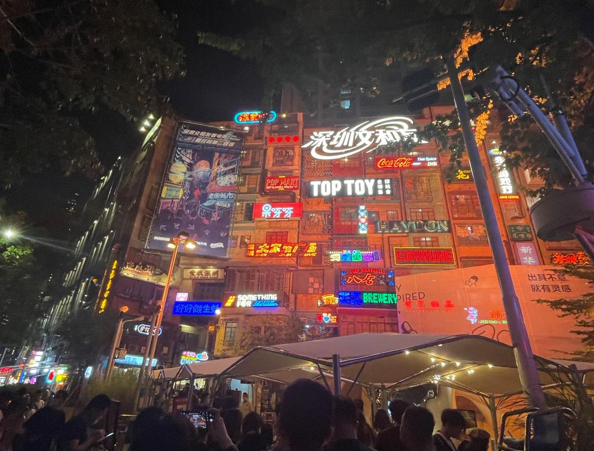
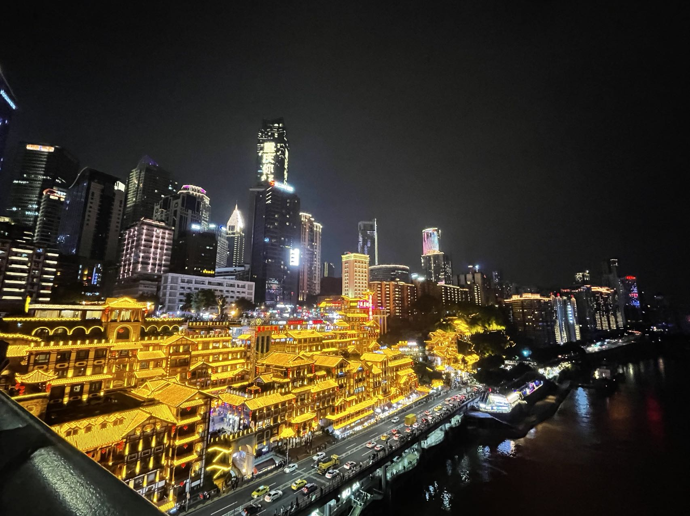
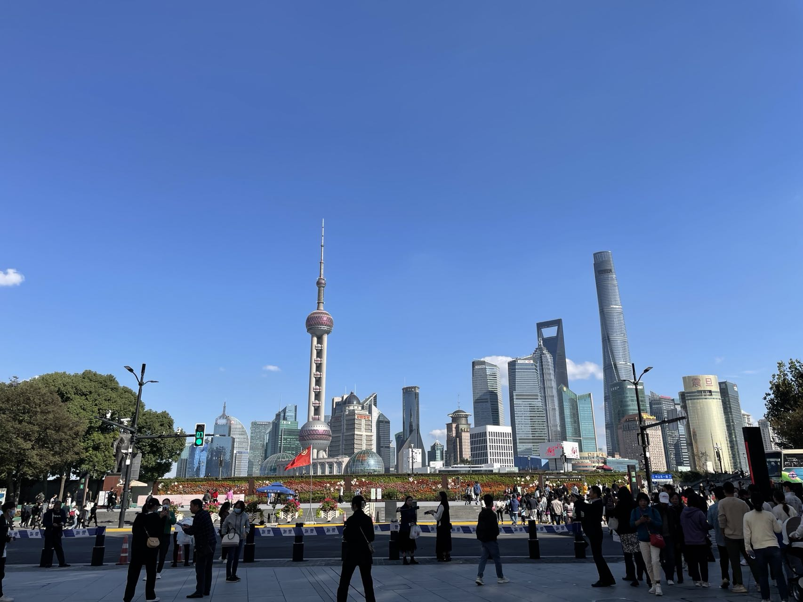

> 说明：本文为英文原文的 AI 辅助中文翻译，可能没有完全保留原文语气；如需核对细节，请切换到 English 版本。
嗯，我比上一篇博客里预计的晚了一个学期才回到加拿大。多亏秋季学期是线上，我多了几个月可以陪家人，也在中国四处走了走。

通过中国海关后，我先隔离了 28 天才回家。虽然很无聊，但在西安隔离时吃到了一些不错的东西。隔离结束后，我打了两针疫苗。原本计划暑假和父母一起旅行，但他们所在大学的政策不允许离开城市，所以我只好自己出门。我选了三个城市：深圳、重庆和上海。

我先到了广东深圳。深圳是一座非常年轻、发展很快的城市，很多科技公司都在那里，比如华为。说实话，我不少同学都在华为工作。我在深圳见了一些朋友，也吃了很多好吃的。深圳外来人口比本地人更多，落户也相对容易，所以这里汇集了来自全国各地的食物。不过深圳也有三种本地文化：广府、潮汕和闽南，每一种都有自己的语言和食物。

接着我去了重庆。这是一座以辣味食物和山城地形闻名的城市。重庆曾经是抗战时期中国的陪都，所以有很多历史建筑。在重庆，走进一栋楼，坐电梯上二十层后到达“地面”也是很常见的事。因为山很多，建筑常常依山而建，所以会有多个入口，有的在底部，有的在顶部，但每个入口都面对道路，于是很难定义哪一层才是“地面”。

最后，我回到了我的“第二故乡”上海。本科四年我都在那里度过。抵达上海时，总有一种熟悉的感觉。虽然因为疫情政策不能进入母校，但我还是去了外滩等以前去过很多次的地方。

飞回大连家里之后，我又遇到了一波疫情。因为大连承担了中国大约 70% 的冷链物流，所以这些企业里很容易发现新病例。除了全城封控，我们两周内做了五次核酸检测。虽然有点激进，但确实有效。

总之，我成功在圣诞前回到了加拿大！圣诞以来一直受时差困扰，不过今天看到太阳之后感觉好多了。希望新的一年里，我们能尽快迎来疫情的终点。

