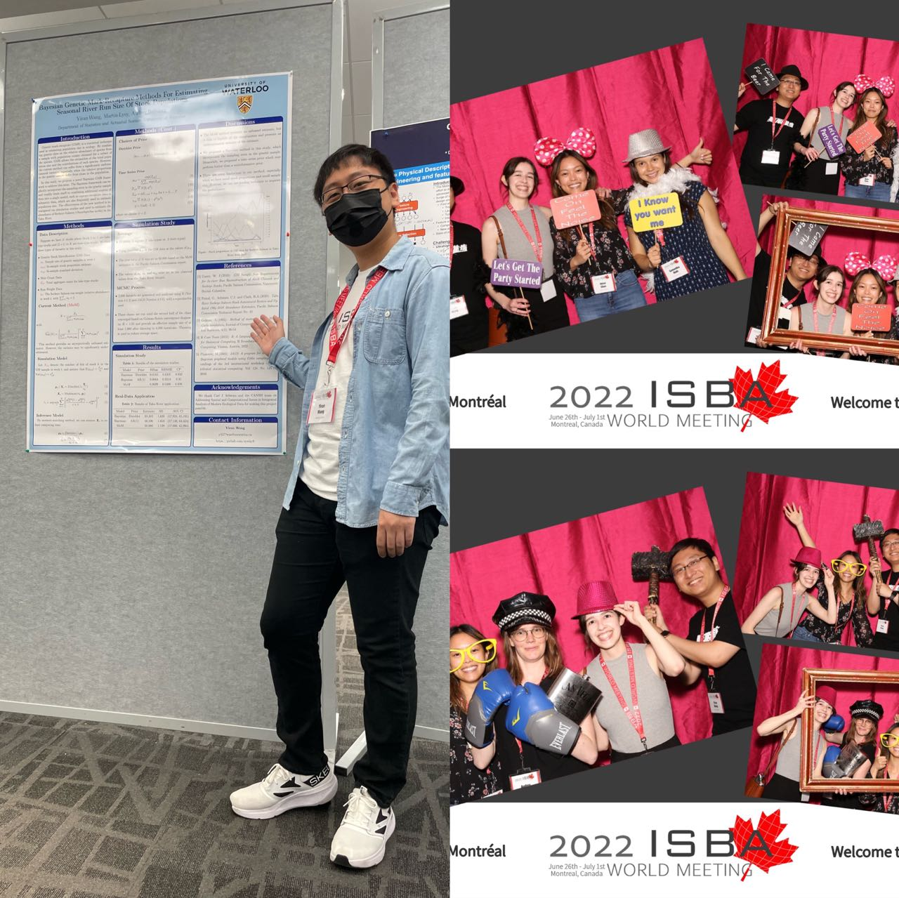
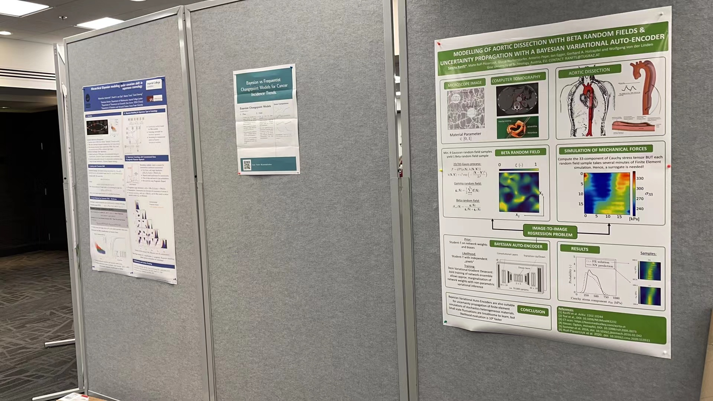
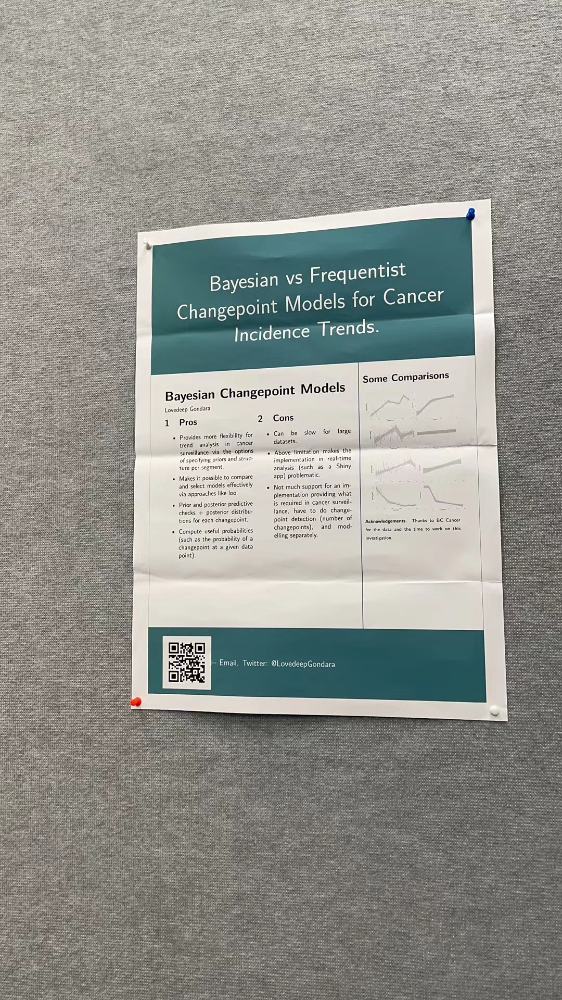
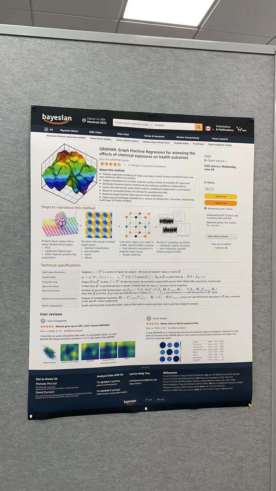
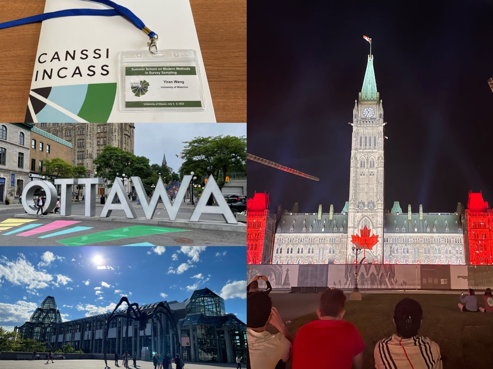
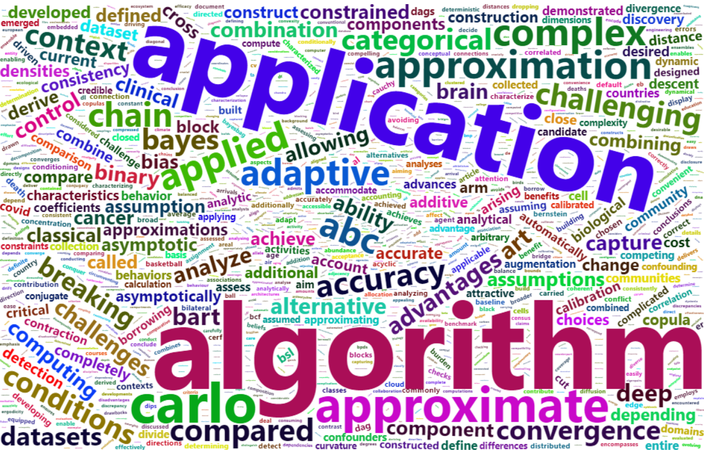
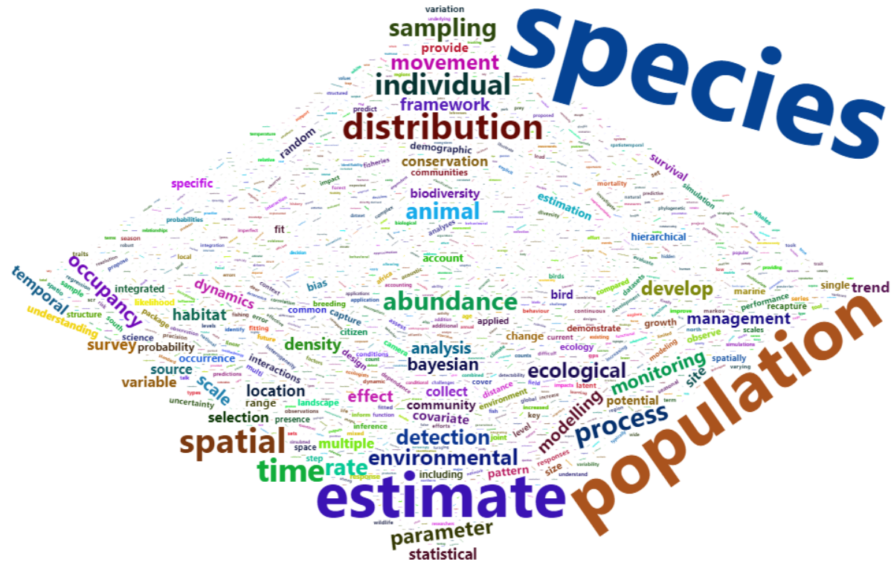

> 说明：本文为英文原文的 AI 辅助中文翻译，可能没有完全保留原文语气；如需核对细节，请切换到 English 版本。
终于，我结束了 2022 年为期两周的会议季！我没想到自己的第一次线下会议会来得这么晚。2019 年刚到滑铁卢时，我本来有机会去澳大利亚悉尼参加 ISEC，签证都准备好了，但疫情来了，会议改成线上。这几年滑铁卢也有一些线下会议，但我其实没有真正“参加”。到博士第三年结束时，我终于有机会去蒙特利尔参加 ISBA 2022！当然，主要原因毫无疑问是它在加拿大。感谢 UC Irvine 的老师们，我在蒙特利尔见到了很多美国的教授，也认识了一些研究生和本科生。Andrew Gelman 没来让我有点遗憾，但我幸运地见到了他的一位即将去 USC 的博士后。很多 Bayesian 聚在一起的感觉很好，在加拿大统计系里不太容易感受到，因为加拿大 Bayesian 没有那么多。我还在 ISBA 开幕致辞期间，在酒店房间里给 ISEC 2022 做了线上报告。这大概会成为一个可以拿来当 fun fact 的少见经历。

虽然有很多有趣的报告，但我发现 poster session 才是真正的宝藏。第一场 poster session 里，有一张海报吸引了所有人的目光。是的，它作为海报实在太小了。

凑近看内容，其实还不错。至少可以去看看他的网站。

还有一些有趣的模板，虽然真正的内容有点难找。

从蒙特利尔回来后，我在家待了两天，给 Mei 准备了一周的食物，然后又出发去渥太华参加 CANSSI summer school。我以前去过蒙特利尔，但这是第一次去渥太华。我和朋友发现机票和火车票价格差不多，而且快很多，于是决定飞过去。但我们的航班先从 Bishop 机场改到 Pearson 机场，之后又经历几次延误通知，最后被取消。幸运的是，我们从 standby list 拿到了晚上 9 点航班的座位，而不是被改签到凌晨 12:30 的航班。

我必须说，和其他报告相比，Changbao 的报告非常精彩。其他报告时我们几乎要睡着了，但他的能量传递给了所有人。遗憾的是，我原本期待在 ISBA 和 summer school 都见到 Xiaoli Meng，但他都没有线下参加。不过我们在渥太华认识了很多新朋友，也看了国会山的灯光秀。

会议季里还有一个有趣的小故事。我在 ISBA 遇到了多伦多大学的 Vianey Leos Barajas 教授，问她美国有没有做统计生态学的老师。她列了一些名字，包括 Penn State 的 Ephraim Hanks 教授。于是我问了来自 Penn State 的新朋友 Samantha，她说认识他的一位博士生，并告诉了我名字。我查到那位同学的 Twitter 说她会来渥太华参加 CANSSI summer school。太巧了！毕竟美国的人听说这个 summer school 的概率几乎不高。于是我在渥太华见到了 Liz，并和她聊了很多统计生态学。能认识并和新朋友交流真的很好，希望我们很快还能再见！

最后，我尝试给 ISBA 和 ISEC 的摘要做词云，看看能不能发现一些热门主题。但结果很难做成我想要的样子。我去掉了一些没有信息量的词，下面是得到的结果。如果能包含特定短语可能会更好，但这太耗时间了，而且老实说我对 NLP 也不熟。如果你知道什么容易理解又容易应用的资源，欢迎告诉我！

