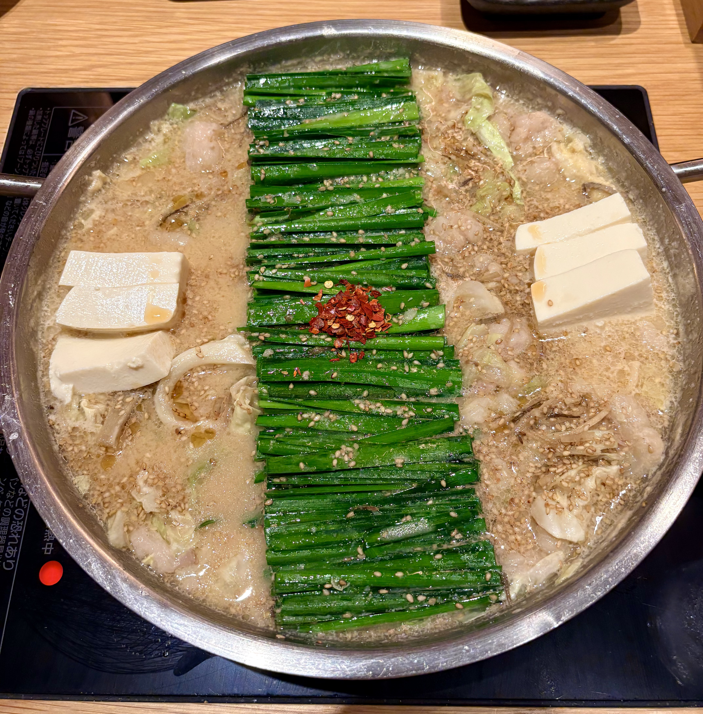
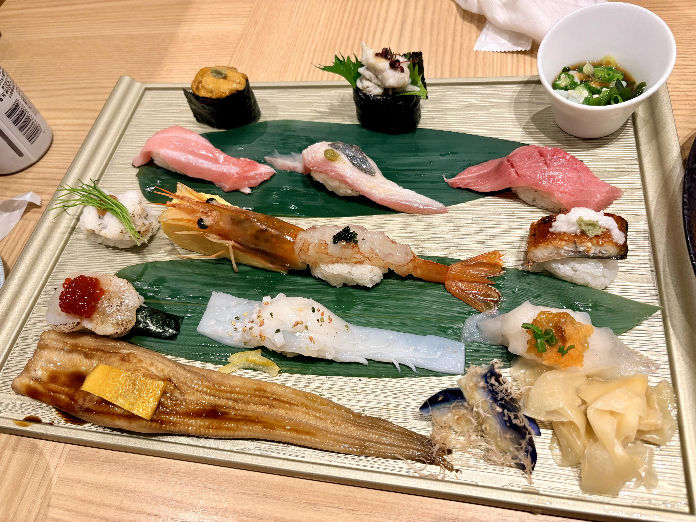

> 说明：本文为英文原文的 AI 辅助中文翻译，可能没有完全保留原文语气；如需核对细节，请切换到 English 版本。

时隔 11 年，我为了自己最喜欢的会议之一 ISBA 再次来到日本！上一次到名古屋还是 2015 年，当时我是一名大二学生，之后一直没有机会再去日本。听说 ISBA 将在名古屋举办时，我非常开心，并决定无论花费多少都一定要参加。于是，我在失业期间完成了会议注册；幸运的是，在参加 ISBA 之前，我拿到了工作 offer。

我最近一直在关注的一个主题是 cut Bayes。我不久前才了解到这类方法，因为在贝叶斯因果推断中，有时我们需要先降低暴露变量的维度，再拟合结局模型。但如果使用联合似然，那么在对暴露进行抽样时，它会以结局为条件，这被称为 outcome feedback。在因果推断中，这种关系并不合理，因为结局不应该反过来影响暴露。因此，cut Bayes 以及 modular Bayes 方法会被用于这类情形。

我很喜欢 Robert Goudie 博士等人的报告，不过我不太喜欢他们使用的动机：当你同时拥有一个高质量数据集和一个低质量数据集时，只使用高质量数据来估计那些也与低质量数据有关的参数，从而避免低质量数据使结果变差。不过，我认为这些方法的目的和我们的问题是一致的，因此也可以用于我们的研究情形。

这趟旅行的另一个目标当然是品尝美味的日本料理。鳗鱼、炸猪排、刺身、寿司……短短一周吃了太多好吃的！

与此同时，我在 ISBA 期间见到了很多朋友。大家绕不开的一个话题就是今年的就业市场。有些朋友已经接受了中国大陆的工作 offer，也有人仍在为明年做准备。祝大家都好运，也希望我们不会被 AI 取代，哈哈。
